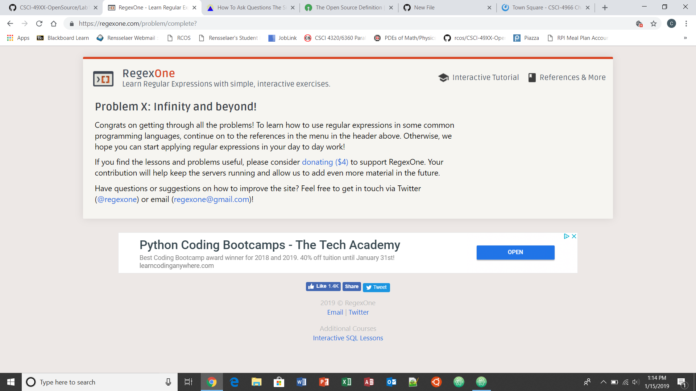
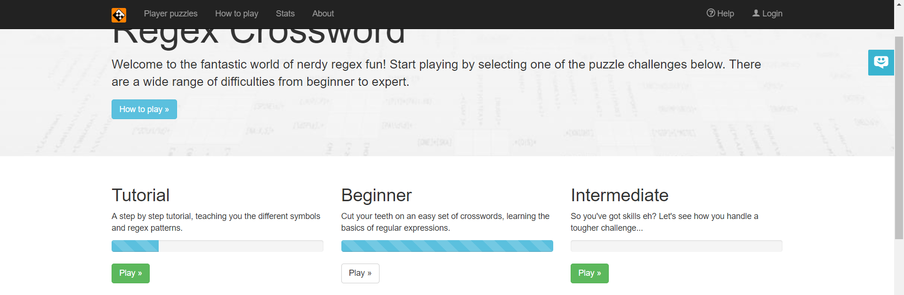

Reflections:
The chapter is flame-bait. It presents a legitimate issue with indexing third-party material, and in the event how it interacts with large lobbies and creative expression. However, Lessig does not in this chapter present a viewpoint on the issue(s) he brings up. I can only assume he means to elicit an emotional response from the reader, in which he was sucessful. The obvious response to such a story is anger and exasperation at something that is obviously (in terms of common sense) against the spirit (and possibly the letter) of the appropriate regulations. Evidently this is also what Jesse Jordan thought, as Lessig states he becomes a "reluctant" activist. 

Practice regex problems: this doesn't actually mean anything.  

Regex beginner problems:  

