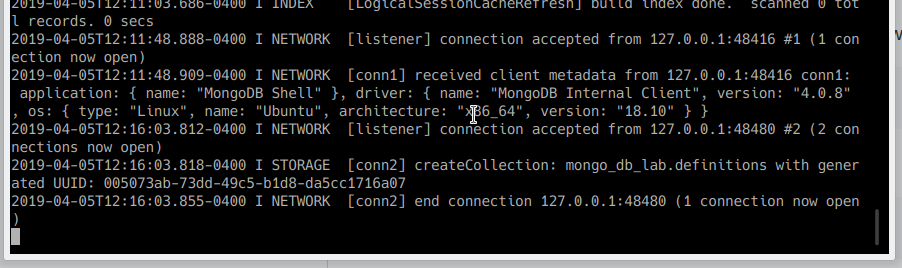
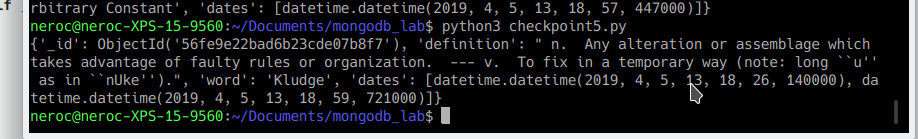

## Mongo connection message and definition creation

## Mongo word updates

## Checkpoint 4 files

* [Python script](checkpoint4.py)
* [Output](output.txt)

# Checkpoint 5 files
* [Python script](checkpoint5.py)

