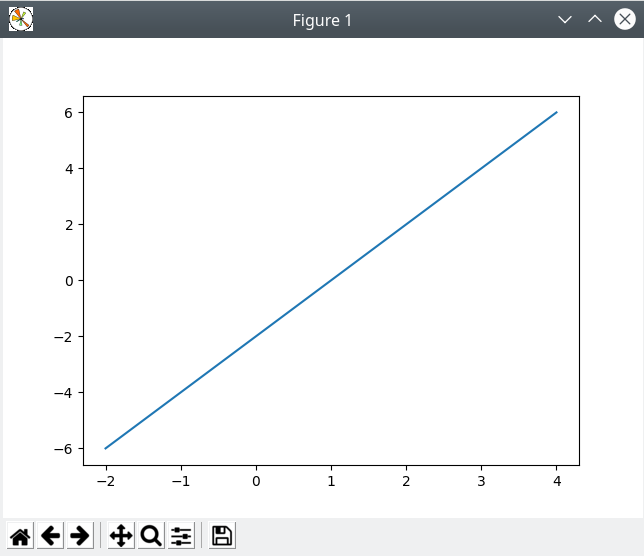
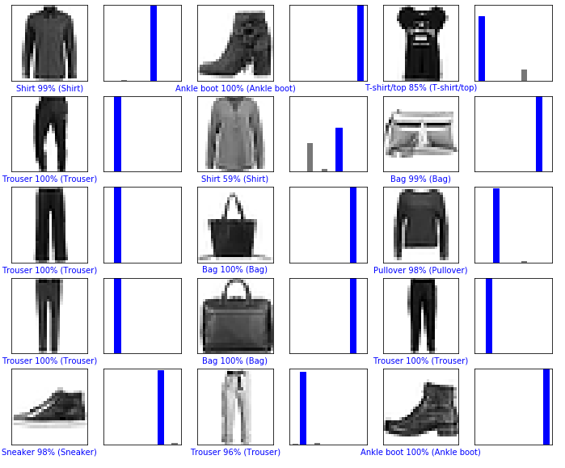
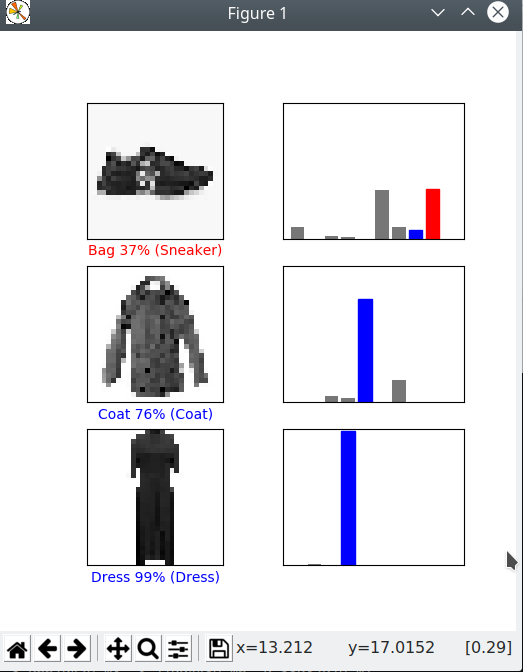

## Installation successful

## Classifying images 9000+

## Custom Images
The model did poorly on the sneaker because the background was not completely blank.

## Python resources

* [Neural network](fashion.py)
* [Image converter](convert.py)
