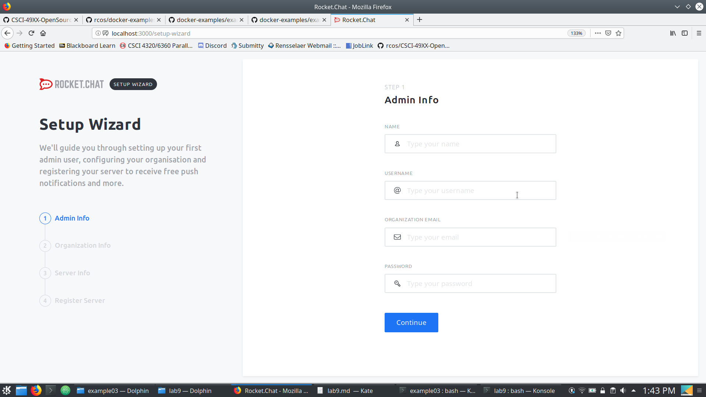

## Example 0
The whale cometh.
```
$ docker run docker/whalesay cowsay run
 _____ 
< run >
 ----- 
    \
     \
      \     
                    ##        .            
              ## ## ##       ==            
           ## ## ## ##      ===            
       /""""""""""""""""___/ ===        
  ~~~ {~~ ~~~~ ~~~ ~~~~ ~~ ~ /  ===- ~~~   
       \______ o          __/            
        \    \        __/             
          \____\______/

```

## Example 1
Cowsay.
```
$ /usr/games/cowsay "Run. Now."
 ___________
< Run. Now. >
 -----------
        \   ^__^
         \  (oo)\_______
            (__)\       )\/\
                ||----w |
                ||     ||

```

## Example 2
Rocket chat.



## Example 3
Hello Docker.

```
$ docker run -p 5000:5000 hello
 * Serving Flask app "hello.py"
 * Environment: production
   WARNING: Do not use the development server in a production environment.
   Use a production WSGI server instead.
 * Debug mode: off
 * Running on http://0.0.0.0:5000/ (Press CTRL+C to quit)
172.17.0.1 - - [29/Mar/2019 17:30:00] "GET / HTTP/1.1" 200 -
172.17.0.1 - - [29/Mar/2019 17:30:00] "GET /favicon.ico HTTP/1.1" 404 -

```

## Example 4
Without the database.
```
$ sudo docker run message-app
debug: The `sails.config.models.connection` setting is deprecated.  Please use `sails.config.models.datastore` instead.
debug: For more info, see http://sailsjs.com/documentation/upgrading/to-v-1-0/#?changes-to-database-configuration

error: A hook (`orm`) failed to load!
error: Could not tear down the ORM hook.  Error details: Error: Consistency violation: Attempting to tear down a datastore (`mongo`) which is not currently registered with this adapter.  This is usually due to a race condition in userland code (e.g. attempting to tear down the same ORM instance more than once), or it could be due to a bug in this adapter.  (If you get stumped, reach out at http://sailsjs.com/support.)
    <stacktrace...>
```

Using curl.
```
$ curl http://localhost:1337/message
[]
$ curl -XPOST http://localhost:1337/message?text=hello%20there
{
  "text": "hello there",
  "createdAt": 1553995172107,
  "updatedAt": 1553995172107,
  "id": "5ca015a43df6403f087c34ad"
}
$ curl http://localhost:1337/message
[
  {
    "text": "hello there",
    "createdAt": 1553995172107,
    "updatedAt": 1553995172107,
    "id": "5ca015a43df6403f087c34ad"
  }
]
```
